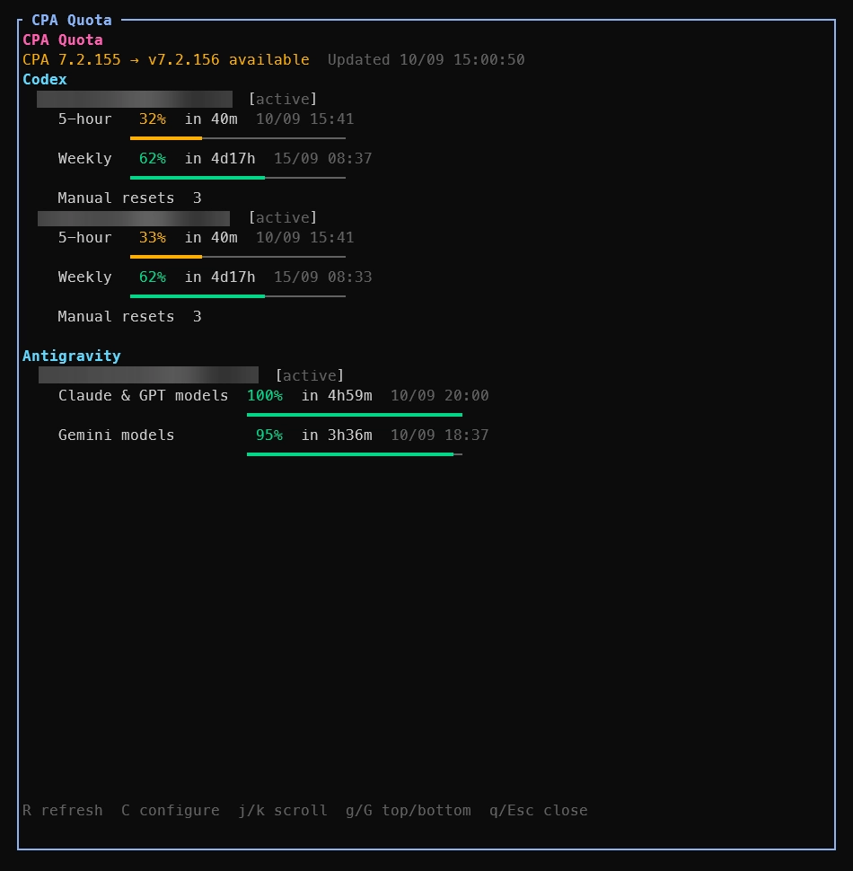
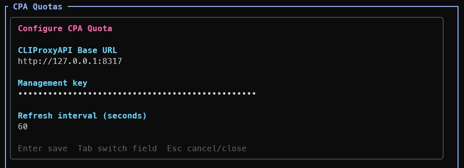

# Herdr CLI Proxy API Quotas Plugin

A Herdr plugin for viewing CLIProxyAPI account quotas directly in your terminal written in Go. Refreshes automatically and can be opened in a split pane beside your work. It is read-only and does not consume any quota or reset credits.

## Quick start

- Open a Herdr terminal and press `prefix+u` to open the CLIProxyAPI Quota View.




## Requirements

- Herdr 0.9.0 or newer
- Go 1.26 or newer

## Install

**Step 1**: Install the plugin from GitHub:

```bash
herdr plugin install HungNth/herdr-cliproxyapi-quotas
```

**Step 2**: Add a keybinding to your Herdr `config.toml` to open the Quota View.

```bash
herdr plugin action invoke herdr-cliproxyapi-quotas.shortcut
```

**Note:**
This appends `prefix+u` to your Herdr `config.toml` unless that key is already bound to a different command. It refuses to run over SSH and never overwrites an existing binding. Remote clients with local keybindings must add the binding manually.

Herdr reads config from:

```plaintext
Linux and macOS: ~/.config/herdr/config.toml
Windows:          %APPDATA%\herdr\config.toml
```

```toml
[[keys.command]]
key = "prefix+u"
type = "plugin_action"
command = "herdr-cliproxyapi-quotas.open"
description = "open CPA quotas"
```

**Step 3**: Reload Herdr configuration:

```bash
herdr server reload-config
```

**Note**: The first view asks for the CLIProxyAPI base URL and management key. Configuration is stored in Herdr's plugin config directory; manual JSON editing is not required.

### For local development:

- MacOS/Linux:

```bash
go build -o bin/cpa-quotas ./cmd/cpa-quotas
herdr plugin link .
```

- Windows:

```powershell
go build -o bin/cpa-quotas.exe ./cmd/cpa-quotas
herdr plugin link .
```

## Data boundary

The plugin only calls these CLIProxyAPI Management API endpoints:

- `GET /v0/management/auth-files`
- `GET /v0/management/latest-version`
- `POST /v0/management/api-call`

All provider quota lookups are read-only requests forwarded through `api-call`. The plugin does not read local token files, call providers directly, consume Codex reset credits, reset CLIProxyAPI quota state, modify accounts, or update CLIProxyAPI.

## Quota View behavior

- `prefix+u` opens the Quota View as a right-hand split (50/50) beside your active pane. Your work pane remains live so you can type, edit, and create further right or down splits without the quota view covering them.
- Focus policy: a configured Quota View opens without stealing focus (`--no-focus`), allowing you to continue typing. On first use (when credentials need to be entered), it receives focus automatically.
- Toggle & dedup: each Herdr Tab owns at most one Quota View. Pressing `prefix+u` from a work pane focuses the existing Quota View; pressing `prefix+u` from inside the focused Quota View closes it as a toggle.
- Resizing and manual rearrangements: the Quota View is a normal Herdr pane; you can drag split dividers, swap panes, or create additional splits around it. If closed manually or via `q`/Escape, the next `prefix+u` reopens a fresh split automatically.
- Automatic refresh: the view re-fetches Quota Snapshots and CPA Version status automatically on a configurable interval (default: 60 seconds, minimum: 5 seconds). You can adjust this in the configure view (`C`) or in `config.json` via `refresh_interval`. A manual refresh (`R` or `r`) restarts the countdown so polls stay evenly spaced.

## Keys

- `R` or `r`: refresh quotas and version status
- `C` or `c`: configure
- `j`/`k`, arrows, Page Up/Page Down, `g`/`G`: scroll
- `q` or Escape: close the view

## Providers

- Codex: 5-hour, weekly, and available manual reset credits
- Claude OAuth: 5-hour and weekly
- Antigravity: `Claude & GPT models` and `Gemini models`

Empty provider groups are hidden. Disabled and unavailable accounts remain visible with status badges.
